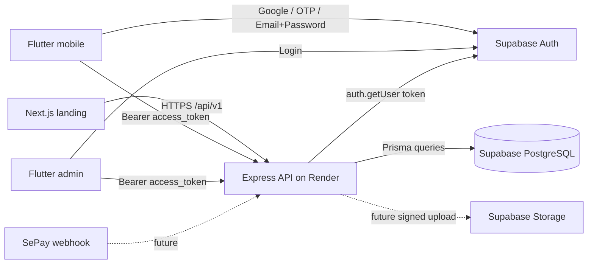

# Tổng quan hệ thống Plant & Flower Shop

## 1. Hệ thống làm gì?

Đây là một monorepo cho nền tảng bán hoa và cây cảnh:

- `apps/mobile`: Flutter app cho khách mua hàng.
- `apps/admin`: Flutter app cho quản trị viên.
- `apps/landing`: Next.js landing page/website công khai.
- `apps/backend`: Express API chạy trên Render.
- Supabase cung cấp Auth và PostgreSQL; Storage có thể bổ sung khi triển khai ảnh.
- Prisma là lớp truy cập database và quản lý migration.

Hiện tại backend đã có health check, authentication middleware, đồng bộ profile
lần đăng nhập đầu tiên và API xem/cập nhật profile. Các bảng category, product,
cart, order, invoice, payment, notification, store và chatbot đã được thiết kế
trong Prisma nhưng route nghiệp vụ tương ứng chưa được hiện thực đầy đủ. Ba app
`mobile`, `admin` và `landing` vẫn đang ở trạng thái khung.

## 2. Kiến trúc chạy thật

Phân chia trách nhiệm:

| Thành phần | Trách nhiệm | Không được làm |
| --- | --- | --- |
| Flutter/Next.js | UI, đăng nhập Supabase, gửi access token | Không giữ secret/service-role key |
| Express API | Validate input, authorization, nghiệp vụ, transaction | Không tin `userId`, `role`, giá tiền từ client |
| Supabase Auth | Tạo session và access token | Không thay thế phân quyền nghiệp vụ trong API |
| Supabase PostgreSQL | Lưu dữ liệu ứng dụng | Không sửa schema production thủ công ngoài migration |
| Render | Build/run API, health check, inject secret | Không lưu secret trong Git |

## 3. Luồng đăng nhập và gọi API

1. App đăng nhập trực tiếp với Supabase Auth bằng Google OAuth, Email OTP hoặc
   Email/Password và publishable key.
2. Supabase trả về session có `access_token`.
3. App gọi Render API với `Authorization: Bearer <access_token>`.
4. `authMiddleware` gọi `supabase.auth.getUser(token)` để xác minh token.
5. `profileMiddleware` tìm `profiles.id` theo Supabase user ID; nếu chưa có thì
   tạo profile `USER/ACTIVE`.
6. Route tiếp tục xử lý nghiệp vụ bằng danh tính đã xác minh trên server.

Backend hiện chỉ cần publishable key cho bước xác minh này. Nếu sau này cần tác
vụ đặc quyền như quản trị Supabase Auth, hãy tạo một Supabase client riêng dùng
secret key, chỉ đặt key đó trong Render và không dùng chung với client xác minh
token.

## 4. Luồng dữ liệu và quyền

- `auth.users` do Supabase Auth quản lý.
- `public.profiles.id` dùng chính UUID của `auth.users.id`, nhưng hiện không tạo
  foreign key xuyên schema.
- `profiles.role` (`USER`/`ADMIN`) là nguồn quyền của ứng dụng; client không
  được phép tự gửi hoặc tự sửa role.
- Backend kết nối PostgreSQL trực tiếp qua Prisma, vì vậy authorization phải
  được kiểm tra trong middleware/service. RLS của Supabase Data API không tự bảo
  vệ các query Prisma chạy bằng database user có quyền cao.
- Tiền dùng `Decimal(18,0)`, phù hợp lưu VND không có phần thập phân.

## 5. Môi trường

| Môi trường | API | Database | Auth |
| --- | --- | --- | --- |
| Local đơn giản | Node local | Supabase PostgreSQL | Supabase project |
| Local Docker | Docker backend | PostgreSQL container | Supabase project |
| Production | Render Docker web service | Supabase PostgreSQL | Supabase project |

Không dùng production database cho test tự động. Khi cần staging, tạo Supabase
project và Render service riêng để tách dữ liệu và secret.

## 6. Tài liệu liên quan

- [Khởi tạo Supabase và deploy Render](supabase-render-setup.md)
- [Đăng nhập Google, OTP và Email/Password](supabase-auth.md)
- [Team conventions](team-conventions.md)
- [Kiến trúc source code](architecture.md)
- [Đặc tả nghiệp vụ/API](spec.md)
